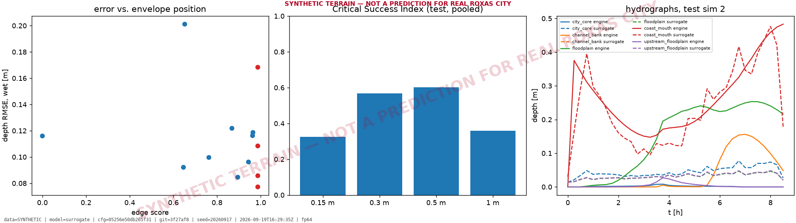
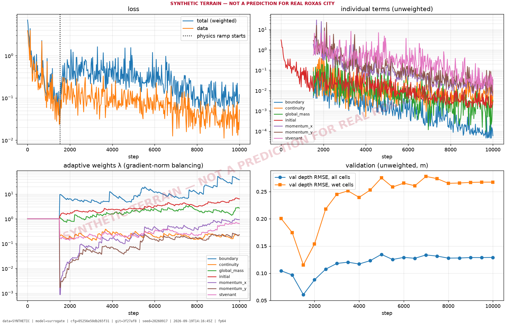
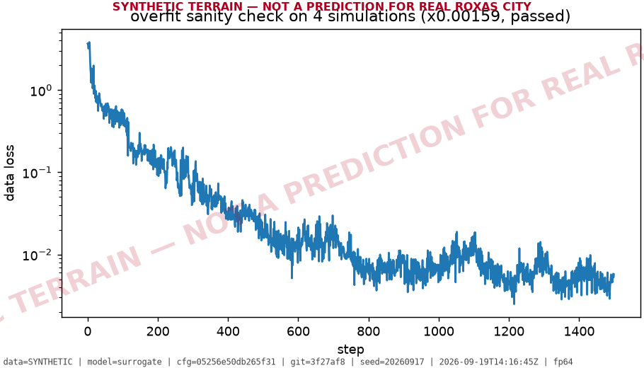

# Validation report: GeoKAN-PINO surrogate vs. held-out engine runs

> **SYNTHETIC TERRAIN — NOT A PREDICTION FOR REAL ROXAS CITY**

| provenance | |
|---|---|
| source | `SYNTHETIC` |
| config_hash | `05256e50db265f31` |
| seed | `20260917` |
| git_commit | `3f27af8` |
| timestamp | `2026-09-19T16:29:35Z` |
| device | `cuda` |
| precision | `fp64` |
| engine | `surrogate` |
| notes | `-` |

## FAILED: storage-direction sign test (hard gate for Part B)

Adding retention storage around the city core must not raise predicted flooding beyond the tolerance established for the engine: at most 5 mm inside the storage footprint, 2 cm anywhere on land, more than 1 cm on at most 0.1% of land, and total flood volume must fall.

Measured: footprint max rise 13.3 mm, land max rise 46.4 mm, share of land rising > 1 cm 0.071%, volume ratio 0.9973.

**This surrogate does not reliably get the direction of an intervention's effect right. Part B must not be built against it: every recommendation it produced would rest on effects the model cannot sign correctly, however good the accuracy numbers below look.**

Test set: **9 simulations** held out by scenario (whole storms, stratified by return period), plus 4 edge-of-envelope probe runs. All numbers below are computed by `evaluate.py`.

## Accuracy against the engine

### Held-out test simulations

| metric | pooled | RP10 | RP25 | RP50 | RP100 |
|---|---|---|---|---|---|
| depth RMSE, wet cells [m] | 0.1163 | 0.1359 | 0.1092 | 0.1161 | 0.09417 |
| depth MAE, wet cells [m] | 0.08396 | 0.09498 | 0.07905 | 0.08592 | 0.07039 |
| depth bias, wet cells [m] | -0.07137 | -0.08018 | -0.06722 | -0.07681 | -0.05689 |
| depth RMSE, all land cells [m] | 0.05813 | 0.06493 | 0.04973 | 0.06076 | 0.05371 |
| depth MAE, all land cells [m] | 0.03725 | 0.03996 | 0.03269 | 0.03742 | 0.03755 |
| depth bias, all land cells [m] | 0.008395 | 0.01034 | 0.01106 | 0.001017 | 0.01018 |
| peak-depth absolute error, median [m] | 0.06593 | 0.05741 | 0.0585 | 0.07987 | 0.07218 |
| peak-depth absolute error, p90 [m] | 0.1944 | 0.1964 | 0.1549 | 0.2347 | 0.1906 |
| peak-depth absolute error, max [m] | 1.504 | 1.539 | 1.509 | 1.557 | 1.395 |
| CSI @ 0.15 m | 0.3244 | 0.3427 | 0.4002 | 0.2775 | 0.2683 |
| CSI @ 0.3 m | 0.568 | 0.5167 | 0.6319 | 0.5216 | 0.6275 |
| CSI @ 0.5 m | 0.6011 | 0.5752 | 0.4977 | 0.6254 | 0.719 |
| CSI @ 1 m | 0.3589 | 0.1963 | 0.2852 | 0.4056 | 0.6298 |
| hit rate @ 0.15 m | 0.3514 | 0.3883 | 0.4256 | 0.2871 | 0.2859 |
| hit rate @ 0.3 m | 0.611 | 0.5708 | 0.6531 | 0.5374 | 0.7027 |
| hit rate @ 0.5 m | 0.6543 | 0.6462 | 0.5167 | 0.6487 | 0.8097 |
| hit rate @ 1 m | 0.3744 | 0.1996 | 0.293 | 0.4236 | 0.6688 |
| false-alarm ratio @ 0.15 m | 0.2006 | 0.3244 | 0.1253 | 0.1085 | 0.1823 |
| false-alarm ratio @ 0.3 m | 0.1163 | 0.1886 | 0.04291 | 0.05569 | 0.1418 |
| false-alarm ratio @ 0.5 m | 0.09909 | 0.1523 | 0.04798 | 0.04363 | 0.1258 |
| false-alarm ratio @ 1 m | 0.06397 | 0.01629 | 0.11 | 0.06047 | 0.09296 |
| speed RMSE, wet cells [m/s] | 0.1875 | 0.1975 | 0.1897 | 0.1822 | 0.1756 |
| flow direction error [deg] | 53.69 | 54.06 | 54.45 | 52.06 | 53.99 |
| 1-D discharge RMSE [m³/s] | 28.38 | 25.05 | 25.16 | 32.63 | 32.34 |
| 1-D peak discharge rel. error | -0.05462 | 0.01747 | -0.008183 | -0.1153 | -0.1485 |
| infiltrated volume rel. error | -0.03407 | 0.02438 | -0.02057 | 0.00712 | -0.1764 |
| stored volume rel. error | -0.2224 | -0.01319 | -0.3855 | -0.1887 | -0.4069 |
| coarse+upsampling-only depth-max RMSE [m] | 0.05859 | 0.05729 | 0.05327 | 0.06587 | 0.05859 |
| surrogate implied mass-balance error | 0.1561 | 0.1213 | 0.1075 | 0.1466 | 0.2664 |
| engine mass-balance error | 2.359e-15 | 1.912e-15 | 2.788e-15 | 2.839e-15 | 2.121e-15 |

### Edge-of-envelope probes (interventions at 97-99% of the sampled ranges)

| metric | edge probes |
|---|---|
| depth RMSE, wet cells [m] | 0.1099 |
| depth MAE, wet cells [m] | 0.07947 |
| depth bias, wet cells [m] | -0.06475 |
| depth RMSE, all land cells [m] | 0.05204 |
| depth MAE, all land cells [m] | 0.03448 |
| depth bias, all land cells [m] | 0.01303 |
| peak-depth absolute error, median [m] | 0.06597 |
| peak-depth absolute error, p90 [m] | 0.1952 |
| peak-depth absolute error, max [m] | 1.466 |
| CSI @ 0.15 m | 0.3155 |
| CSI @ 0.3 m | 0.553 |
| CSI @ 0.5 m | 0.5883 |
| CSI @ 1 m | 0.1785 |
| hit rate @ 0.15 m | 0.3642 |
| hit rate @ 0.3 m | 0.6571 |
| hit rate @ 0.5 m | 0.6728 |
| hit rate @ 1 m | 0.1996 |
| false-alarm ratio @ 0.15 m | 0.2759 |
| false-alarm ratio @ 0.3 m | 0.2076 |
| false-alarm ratio @ 0.5 m | 0.159 |
| false-alarm ratio @ 1 m | 0.304 |
| speed RMSE, wet cells [m/s] | 0.1927 |
| flow direction error [deg] | 52.48 |
| 1-D discharge RMSE [m³/s] | 31.48 |
| 1-D peak discharge rel. error | -0.005017 |
| infiltrated volume rel. error | -0.03035 |
| stored volume rel. error | -0.213 |
| coarse+upsampling-only depth-max RMSE [m] | 0.05446 |
| surrogate implied mass-balance error | 0.09036 |
| engine mass-balance error | 1.319e-15 |

### Hydrographs at monitoring points (test set)

| point | mean NSE | median NSE | mean peak-timing error [h] | mean peak-depth error [m] |
|---|---|---|---|---|
| city_core | -483.566 | -450.842 | 1.75 | 0.058 |
| channel_bank | -7561.770 | -5786.954 | 1.47 | 0.018 |
| floodplain | -0.845 | -0.929 | 0.64 | -0.152 |
| coast_mouth | 0.584 | 0.705 | -0.08 | -0.054 |
| upstream_floodplain | -25.762 | -17.721 | 2.69 | 0.020 |

NSE is undefined (NaN) where the engine hydrograph is constant (e.g. a point that stays dry).

### Baseline states against modified states (test set)

| group | n | depth RMSE wet [m] | peak-depth abs. error p90 [m] | CSI @ 0.3 m |
|---|---|---|---|---|
| baseline site (no intervention) | 1 | 0.116 | 0.2304 | 0.480 |
| modified site | 8 | 0.1163 | 0.1899 | 0.579 |

## Does the surrogate predict the effect of an intervention?

This is the question Part B asks. Effect = peak depth with the design minus peak depth on the baseline site, same scenario; engine against surrogate. 'Affected' cells are land cells where either model says the design moved peak depth by more than 1 cm. **Sign agreement** is the share of cells the engine says changed where the surrogate gets the direction right: below ~0.5 the surrogate is no better than a coin at saying whether a design helps a place or hurts it.

| case | intensity | engine-changed cells | effect RMSE [m] | effect bias [m] | sign agreement | corr | max rise eng / sur [m] | area worsened eng / sur [ha] |
|---|---|---|---|---|---|---|---|---|
| test 6 | 1.01 | 14477 | 0.108 | +0.060 | 0.53 | -0.41 | 0.042 / 0.175 | 1.3 / 53.9 |
| test 9 | 1.13 | 20835 | 0.078 | +0.030 | 0.56 | -0.08 | 0.041 / 0.187 | 69.5 / 292.6 |
| test 11 | 0.28 | 21991 | 0.061 | +0.034 | 0.49 | -0.49 | 0.041 / 0.078 | 8.8 / 11.0 |
| test 25 | 0.62 | 8945 | 0.041 | +0.010 | 0.71 | -0.28 | 0.059 / 0.092 | 22.4 / 20.7 |
| test 32 | 0.80 | 13999 | 0.079 | +0.033 | 0.54 | 0.02 | 0.021 / 0.263 | 0.6 / 308.2 |
| test 36 | 0.05 | 18387 | 0.027 | +0.020 | 0.55 | -0.36 | 0.016 / 0.039 | 0.1 / 3.4 |
| test 48 | 0.74 | 8985 | 0.077 | +0.022 | 0.61 | 0.36 | 0.263 / 0.050 | 128.4 / 139.8 |
| test 59 | 0.63 | 20342 | 0.080 | +0.053 | 0.76 | -0.44 | 0.020 / 0.064 | 0.4 / 3.0 |
| storage only | 0.03 | 7092 | 0.116 | +0.087 | 0.68 | -0.06 | 0.029 / 0.017 | 6.6 / 0.6 |
| infiltration only | 0.01 | 2206 | 0.084 | +0.039 | 0.41 | -0.01 | 0.004 / 0.015 | 0.0 / 0.4 |
| roughness only | 0.52 | 2197 | 0.027 | -0.008 | 0.45 | 0.07 | 0.115 / 0.123 | 47.0 / 107.6 |
| conveyance only | 0.51 | 5103 | 0.096 | +0.080 | 0.53 | -0.01 | 0.027 / 0.006 | 2.5 / 0.0 |

- **moderately modified (intensity <= median)**, 4 storms: mean effect RMSE 0.052 m, mean sign agreement 0.63
- **heavily modified (intensity > median)**, 4 storms: mean effect RMSE 0.085 m, mean sign agreement 0.56

Area change at thresholds (engine / surrogate, ha): test 6: 0.15 m -273.2/-21.8, 0.3 m -112.0/-11.5, 0.5 m -4.9/-8.0; test 9: 0.15 m -252.4/-31.8, 0.3 m -44.7/-24.5, 0.5 m -0.4/-6.8; test 11: 0.15 m -235.7/-18.3, 0.3 m -73.0/-18.2, 0.5 m -0.2/-13.2; test 25: 0.15 m -48.5/-20.7, 0.3 m -6.6/-13.4, 0.5 m -0.6/-5.1; test 32: 0.15 m -199.0/+13.0, 0.3 m -29.6/-2.0, 0.5 m -0.3/-11.8; test 36: 0.15 m -81.1/-2.8, 0.3 m -4.1/-3.5, 0.5 m -0.4/-2.8; test 48: 0.15 m -29.6/+23.2, 0.3 m +10.2/+0.1, 0.5 m +0.3/-0.1; test 59: 0.15 m -237.2/-22.1, 0.3 m -128.7/-13.6, 0.5 m -6.9/-6.1; storage only: 0.15 m -90.9/-2.7, 0.3 m -7.4/-0.5, 0.5 m +0.2/+0.0; infiltration only: 0.15 m -7.8/-0.2, 0.3 m -2.4/+0.0, 0.5 m -1.8/-0.0; roughness only: 0.15 m +7.4/-2.5, 0.3 m +0.8/-8.6, 0.5 m +0.1/-7.4; conveyance only: 0.15 m -61.2/-0.0, 0.3 m -2.5/+0.0, 0.5 m +0.0/+0.0

### Storage-direction test on the engine itself (same grid, scenario and criteria)

| item | engine | surrogate |
|---|---|---|
| footprint_max_increase_m | 0.04031825065612793 | 0.01328134536743164 |
| land_max_increase_m | 0.04031825065612793 | 0.0463559627532959 |
| land_fraction_increase_gt_1cm | 3.2835330815957974e-05 | 0.0007059596125430964 |
| passed | False | False |
| volume ratio (design / baseline) | 0.9631 (peak-depth sum) | 0.9973 (depth-series sum) |

## Speed

Same machine (cuda). Engine: median 341.2 s per storm (from the dataset generation logs). Surrogate: median 1107 ms per storm, measured end to end through `api.predict` (forcing construction, feature coarsening, encoder, decoder for all output times, bilinear upsampling, transfer to CPU). **Speedup factor: 308x.**

## Error versus distance from the training distribution

`edge_score` is 0 at the centre of the sampled intervention ranges and 1 at a range limit.

| group | n | mean edge score | depth RMSE wet [m] | CSI @ 0.3 m |
|---|---|---|---|---|
| test, edge < 0.5 | 1 | 0.00 | 0.116 | 0.480 |
| test, edge >= 0.5 | 8 | 0.84 | 0.1163 | 0.579 |
| edge probes | 4 | 0.99 | 0.1099 | 0.553 |

Part B must clip its search to the envelope in `dataset_card.md`; `FloodResult.in_distribution` and `distribution_warnings` flag queries outside it.

## Directional check: storage must not increase depth (surrogate)

| item | value |
|---|---|
| scenario | RP100 RCP4.5/SSP2 2050, storage raised to 0.6 m within 1.5 km of the city core |
| footprint_max_increase_m | 0.01328134536743164 |
| footprint_mean_change_m | -0.002904169261455536 |
| land_max_increase_m | 0.0463559627532959 |
| land_fraction_increase_gt_1cm | 0.0007059596125430964 |
| total_depth_volume_ratio | 0.997267932933946 |
| passed | False |

Overfit sanity check: data loss on 4 simulations fell from 3.468 to 0.005512 in 1500 steps (passed).

## Why the scenario pathways matter

Forward-looking climate and socioeconomic pathways set the design tolerance for long-lifecycle assets: drainage, embankments and retention built now must still perform at the horizon year. Designing to present-day rainfall, sea level and land cover systematically under-engineers public safety infrastructure, because intensities, tide levels and impervious area all rise over the asset's life. In this system the RCP pathway scales rainfall and sets sea-level rise; the SSP pathway expands urban land along the road network (raising roughness, cutting infiltration and removing bund storage), scales exposure, and sets the baseline channel conveyance. Default pairings: SSP1–RCP2.6, SSP2–RCP4.5, SSP3–RCP6.0, SSP4–RCP6.0, SSP5–RCP8.5 (SSP3 is conventionally paired with RCP7.0, which the placeholder table does not carry).

## Limitations

- Terrain, land use and channel network are SYNTHETIC (procedurally generated). Nothing in this report is a prediction for real Roxas City.
- Rainfall uses PLACEHOLDER_IDF_ROXAS (a=609.0, b=0.18, c=12.0, e=0.7), not PAGASA-published coefficients.
- No calibration against observed flood events has been performed (no obs_flood layer).
- Infiltration (Horton f0/fc/k) and Manning values are uncalibrated table values for 8 land-use classes.
- Tidal constituents, upstream catchment parameters (area 120 km², runoff coefficient 0.45), RCP rainfall/SLR factors and SSP modifiers are placeholders.
- Numerics: MUSCL + SSP-RK2 finite volumes on a 400 x 325 grid at 20 m, dry threshold 0.001 m, CFL 0.45, fp64; 1-D channels first order, above-bank width 1 x bankfull top width; weir exchange Cw = 1.7.
- The surrogate is trained on a 2x-coarsened grid and upsampled bilinearly; the error this adds is reported separately (upsampling_only).
- Thin rain-on-grid sheets on steep cells: first-order hydrostatic reconstruction gave a 12.5% rising-limb error on the tilted-plane benchmark versus 0.8% with MUSCL.
- Dry threshold 0.001 m: on a 10 cm-deep lab-scale Thacker bowl it produces a 14.0% error after 3 periods; very shallow flows (centimetres) are represented less accurately than flood depths.
- Antecedent conditions: every storm starts with empty retention storage and dry soil (Horton f0).
- Rainfall is spatially uniform over the domain; the RCP rainfall factor is applied without horizon-year interpolation (only sea-level rise is interpolated).
- Urban fabric follows one interpretation of the specification: streets are the lowest paths, blocks are raised (0.2, 0.4) m and buildings a further 0.3 m.
